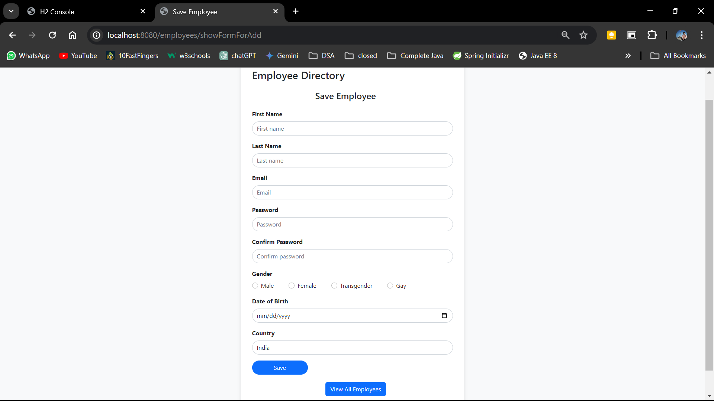
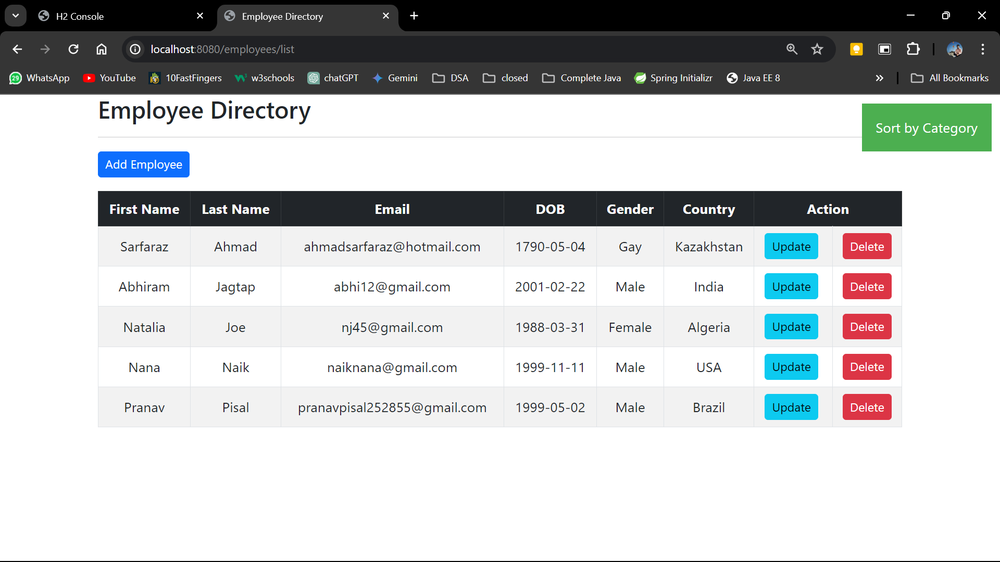
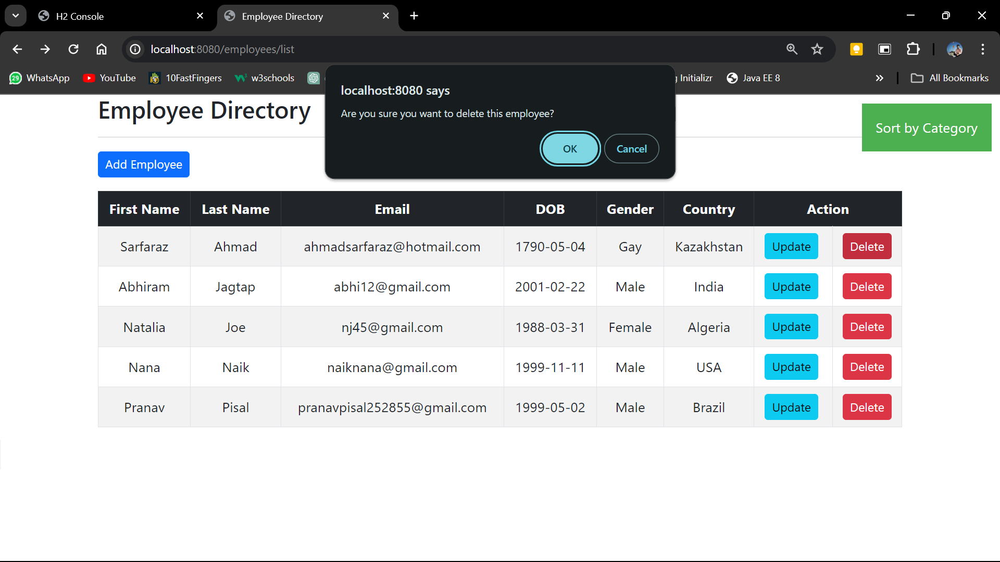
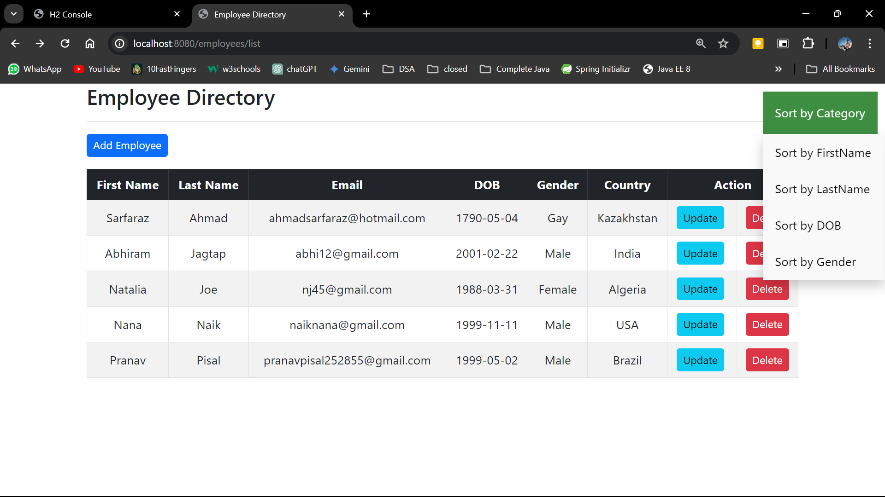
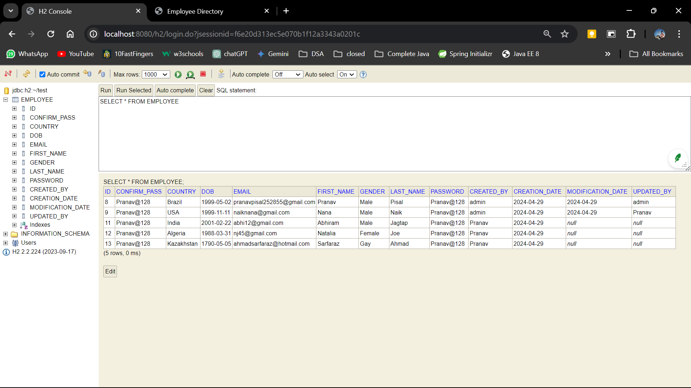
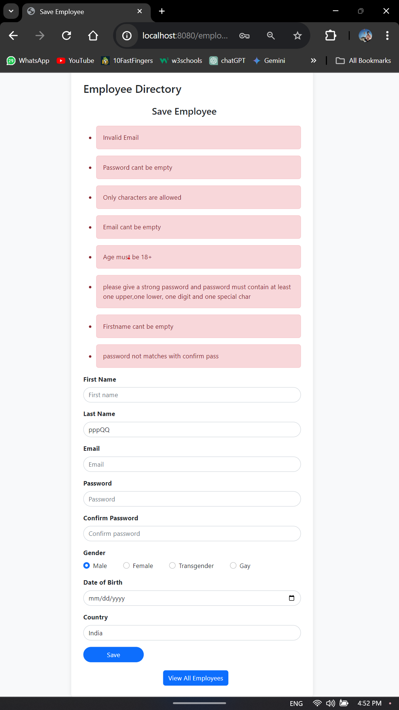
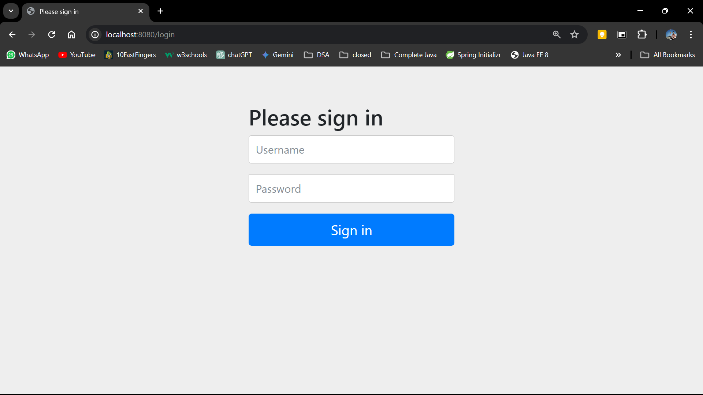
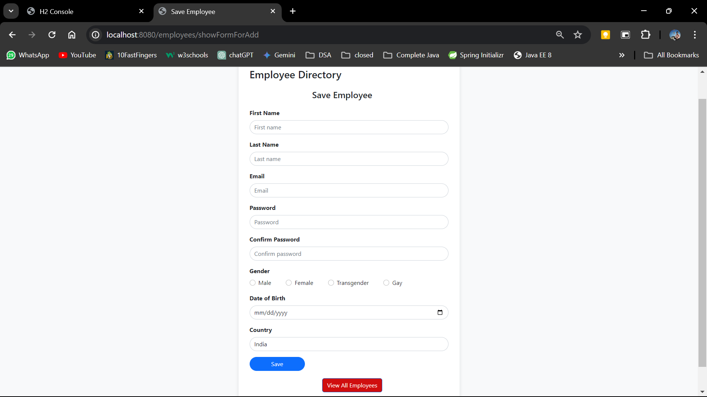

# Spring MVC CRUD Application

This is robust and secure Spring MVC CRUD (Create, Read, Update, Delete) application built using Spring MVC, Spring Security, Lombok, H2 database, and Thymeleaf. It provides a user interface for managing data entities with basic validation.

Live experience: [Check here](https://spring-mvc-crud-app.onrender.com/employees/list).

## Features

- **CRUD Operations**: Perform Create, Read, Update, and Delete operations on data entities.
- **Spring Security**: Secure the application with authentication and authorization features.
- **Lombok**: Reduce boilerplate code by using Lombok annotations.
- **H2 Database**: Use an in-memory H2 database for storing application data.
- **Thymeleaf**: Use Thymeleaf as the template engine for server-side rendering.
- **Validation**: Implement validation for user inputs to ensure data integrity.

## Prerequisites

Before running the application, make sure you have the following installed:

- Java Development Kit (JDK) 8 or higher
- Maven
- IDE (e.g., IntelliJ IDEA, Eclipse)
- Database Configuration: (If not using the default H2 settings)


## Getting Started

To run the application locally, follow these steps:

1. Clone the repository:

   ```bash
   https://github.com/Pranav128/spring-mvc-crud.git

2. Update database connection properties in application.properties or application.yml
- Feel free to customize this template according to your specific project details, such as adding more sections about the architecture, implementation details, or additional features.

# Screenshots
### ~ Insert Employee (Create)
### 
### ~ All Employees List (Read)
### 
### ~ Delete an Employee (Delete)
### 
### ~ All Employees List (Sort)
### 
### ~ Database View
### 
### ~ Validations
### 
### ~ Spring Security Login
### 
### 


### Reference Documentation

For further reference, please consider the following sections:

* [Official Apache Maven documentation](https://maven.apache.org/guides/index.html)
* [Spring Boot Maven Plugin Reference Guide](https://docs.spring.io/spring-boot/docs/3.2.5/maven-plugin/reference/html/)
* [Create an OCI image](https://docs.spring.io/spring-boot/docs/3.2.5/maven-plugin/reference/html/#build-image)
* [Spring Boot DevTools](https://docs.spring.io/spring-boot/docs/3.2.5/reference/htmlsingle/index.html#using.devtools)
* [Spring Security](https://docs.spring.io/spring-boot/docs/3.2.5/reference/htmlsingle/index.html#web.security)
* [Thymeleaf](https://docs.spring.io/spring-boot/docs/3.2.5/reference/htmlsingle/index.html#web.servlet.spring-mvc.template-engines)
* [Validation](https://docs.spring.io/spring-boot/docs/3.2.5/reference/htmlsingle/index.html#io.validation)
* [Spring Web](https://docs.spring.io/spring-boot/docs/3.2.5/reference/htmlsingle/index.html#web)

### Guides

The following guides illustrate how to use some features concretely:

* [Securing a Web Application](https://spring.io/guides/gs/securing-web/)
* [Spring Boot and OAuth2](https://spring.io/guides/tutorials/spring-boot-oauth2/)
* [Authenticating a User with LDAP](https://spring.io/guides/gs/authenticating-ldap/)
* [Handling Form Submission](https://spring.io/guides/gs/handling-form-submission/)
* [Validation](https://spring.io/guides/gs/validating-form-input/)
* [Building a RESTful Web Service](https://spring.io/guides/gs/rest-service/)
* [Serving Web Content with Spring MVC](https://spring.io/guides/gs/serving-web-content/)
* [Building REST services with Spring](https://spring.io/guides/tutorials/rest/)


